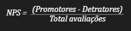
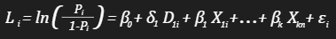
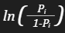
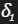
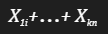
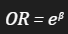

# Análise das avaliações dos clientes da loja de marketplace Olist

## 1. Contexto

Atualmente, as avaliações dos clientes representam um dos principais sinais de qualidade, credibilidade e reputação no mercado. Avaliações negativas tendem a influenciar diretamente a decisão de compra, levando o consumidor a desistir mesmo quando o produto atende às suas necessidades, enquanto avaliações positivas exercem o efeito oposto. Pela ótica das empresas, manter elevados níveis de satisfação reflete fidelização, diferenciação e potencial de crescimento de receita, contribuindo para a maximização do lucro. Contudo, a análise de avaliações de clientes envolve dados majoritariamente categóricos e textuais, sendo desafios metodológicos que demandam o uso de técnicas estatísticas avançadas para a interpretação.

## 2. Objetivos

- Descobrir os principais motivos para as avaliações negativas dos clientes;
- Sugerir ações que possam maximizar a satisfação dos clientes e consequentemente sua avaliação.

## 3. Metódos
### 3.1. Métrica Net Promoter Score (NPS)

Inicialmente utilizei a NPS, que é amplamente aplicada no mercado para medir a satisfação dos clientes. Ela é baseada em apenas uma pergunta: 

*Em uma escala de 0 a 10, o quanto você recomendaria nossa empresa/produto/serviço para um amigo ou colega?*

Notas entre 9 e 10 são classificados como Promotores, ou seja, consumidores satisfeitos e propensos a comportamentos que geram valor para o produto, serviço ou marca, como a recompra, a fidelização e a recomendação positiva a potenciais novos clientes. Por outro lado, clientes que atribuem notas entre 1 a 6 são classificados como Detratores, representando indivíduos menos propensos à fidelização ou à geração de valor para o negócio. Já os clientes que respondem com notas entre 7 e 8 são considerados Neutros ou Passivos.

Entretanto, foi necessário realizar uma adaptação da metodologia NPS considerando a característica das avaliações adotadas pela empresa Olist, onde as notas de avaliação possuem uma escala menor de 1 a 5. Nesse sentido, as notas de 4 e 5 foram atribuídas a clientes promotores e de 1 a 3 a clientes detratores. A categoria de clientes neutros ou passivos foram desconsiderados devido a limitação na escala das notas.

O indicador pode ser calcula pela seguinte equação:

O resultado varia de -100 a +100:

- Acima de 50: Excelente;
- Entre 0 e 50: Bom;
- Abaixo de 0: Precisa de melhorias.

### 3.2. Modelo de regressão logística

O método quantitativo utilizado para embasar a pesquisa foi o modelo de regressão logística, também conhecido como modelo logit. Esse tipo de abordagem é indicado quando o objeto de estudo possui natureza qualitativa, como ocorre no caso das avaliações dos clientes. Situações em que a resposta de interesse é binária, por exemplo, identificar se a quantidade de fotos disponíveis de um produto aumenta ou reduz a probabilidade de um pedido ser avaliado negativamente, justificam o uso desse modelo. Nesse contexto, a variável resposta assume valores categóricos binários (1 para ocorrência do evento e 0 para não ocorrência), possibilitando a estimação da probabilidade de um determinado resultado. A especificação do modelo pode ser representada pela seguinte equação:

Onde:

-  = É o logaritmo da razão de chances (log-odds) do evento ocorrer, ou seja, a transformação logit da probabilidade Pi . Essa transformação lineariza a relação entre as variáveis independentes e a variável dependente binária;  

-  = Representa o logaritmo natural da razão entre a probabilidade de sucesso (Pi) e a probabilidade de fracasso (1-Pi). Essa razão é chamada de odds ou chances. A equação transforma uma variável que originalmente varia entre 0 e 1 (probabilidade) em uma variável contínua que varia de −∞ a +∞;	     

-  = É o termo constante (intercepto) da regressão, representando o log-odds do evento quando todas as variáveis independentes forem iguais a zero;   

-  = Parâmetro que indica o efeito da variável qualitativa sobre a variável dependente;

-  = Variável binária que indica a ocorrência ou não de um evento;

- = São os coeficientes das variáveis independentes, discretas e contínuas, que indicam o efeito marginal de cada variável sobre o evento;   

- = Representam as variáveis independente exploradas mais detalhadamente logo a frente;   

- = É o termo de erro, que capta o efeito de variáveis não observadas que também influenciam o resultado.

Os coeficientes estimados pelo modelo representam variações nos log-odds (logaritmo da razão entre a probabilidade do evento acontecer e a probabilidade de ele não acontecer), e não nas probabilidades diretamente. Para que esses coeficientes tenham interpretação prática, é necessário exponencia-los, obtendo então os chamadas odds ratios:

O odds ratio (razão de chances) indica, *ceteris paribus*, o quanto as chances do evento de interesse se alteram quando há uma variação marginal na variável explicativa.

#### 3.2.1. Variáveis do modelo

A seguir, são apresentadas as variáveis extraídas da base de dados da Olist:
- review_score: Avaliação do cliente (escala de 1 a 5);
- order_delivered_customer_date: Data de entrega do pedido;
- order_estimated_delivery_date: Data estimada para entrega do pedido;
- product_photos_qty: Quantidade de fotos do produto exibidas no site;
- product_weight_g: Peso do produto (em gramas);
- product_length_cm: Comprimento do produto (em centímetros);
- product_height_cm: Altura do produto (em centímetros);
- product_width_cm: Largura do produto (em centímetros);
- geolocation_lat_seller: Latitude da localização do vendedor;
- geolocation_lng_seller: Longitude da localização do vendedor;
- geolocation_lat_customer: Latitude da localização do cliente;
- geolocation_lng_customer: Longitude da localização do cliente;
- price: preço do produto;
- freight_value: valor do frete.

Essas variáveis foram servidas como base para a construção de novas variáveis, alinhadas de forma mais adequada ao contexto analítico proposto neste estudo. A seguir, apresenta-se o detalhamento do tratamento dos dados realizados para essa adaptação.

A variável dependente de avaliação dos clientes (review_score), foi transformada em uma variável binária, na qual o valor 1 representa os Detratores e o valor 0 os Promotores. As variáveis Data de entrega do pedido (order_delivered_customer_date) e Data estimada para entrega do pedido (order_estimated_delivery_date) foram utilizadas para calcular a diferença entre a data estimada e a data real de entrega.  

Esse cálculo permitiu identificar se o pedido foi entregue dentro ou fora do prazo. Valores negativos indicam entregas realizadas antes da data estimada, enquanto valores positivos representam atrasos. Com base nesse resultado, foi criada a variável binária flag_entrega, que assume o valor 1 para pedidos entregues fora do prazo e 0 para aqueles entregues dentro do prazo, permitindo avaliar a influência do cumprimento do prazo de entrega nas avaliações dos consumidores.   

As variáveis Comprimento do produto (product_length_cm), Altura do produto (product_height_cm) e Largura do produto (product_width_cm) foram utilizadas para o cálculo do volume do produto. A partir dessa operação, foi criada a variável independente volume_product, expressa em centímetros cúbicos (cm³), com o objetivo de incorporar a dimensão espacial do item como possível fator explicativo nas avaliações dos consumidores.   

Já as variáveis de localização geográfica do vendedor e do cliente foram utilizadas na aplicação da fórmula de Haversine para calcular a distância geográfica entre os dois pontos. Essa fórmula é um método matemático reconhecido para estimar a distância mais curta entre dois pontos na superfície esférica da Terra a partir das coordenadas de latitude e longitude, corrigindo a curvatura do planeta e proporcionando uma medida mais precisa do que a distância euclidiana simples (UnB, 2025).   

O objetivo foi mensurar a distância entre o local de envio e o local de entrega dos pedidos, criando assim a variável derivada distancia_km. Essa variável independente foi incluída no modelo para verificar se a distância geográfica entre vendedor e cliente exerce influência nas avaliações negativas dos consumidores.    

Devido à forte assimetria à direita das variáveis monetárias (valor de venda e frete), aplicou-se a transformação logarítmica natural com o objetivo de reduzir a influência de valores extremos, melhorar a estabilidade do modelo e melhorar a interpretação econômica sobre a probabilidade do evento analisado.

Outros dois componentes de tratamento dos dados foram: (i) o filtro para considerar somente pedidos efetivamente entregues; (ii) e a exclusão de linhas com valores vazios, diminuindo levemente o número da amostra para 94.646 observações.
A Tabela 1 apresenta o conjunto final de todas as variáveis a serem utilizadas na construção do modelo.

**1. Tabela - Variáveis qualitativas**

| Variáveis do modelo | Descrição das variáveis
|----------|----------
| Variável dummy dependente | Detratores = 1, Promotores = 0
| Variável dummy independente | Pedidos entregues fora do prazo = 1, Pedidos entregues fora do prazo = 0

**2. Tabela - Variáveis quantitativas**
| Variáveis do modelo | Descrição das variáveis
|----------|----------
| Variável independente discreta | Quantidade de fotos do produto
| Variável independente contínua | Peso do produto
| Variável independente contínua | Volume do produto
| Variável independente contínua (log) | Preço do produto
| Variável independente contínua (log) | Preço do frete
| Variável independente contínua | Distância entre loja e consumidores (km)

# [Clique aqui para acessar a análise dos resultados](apresentacao/análise.pdf)    

### Outros atalhos para acesso dos arquivos do projeto
[Clique aqui](notebook/modelo1.ipynb) para acessar ao notebook do modelo de regressão logística.   
[Clique aqui](querys/analise-2/2-query.sql) para acessar as querys elaboradas para a estruturação da base de dados utilizada no modelo.     
[Clique aqui](https://app.powerbi.com/view?r=eyJrIjoiMDk0ZDA5MTItODYwZi00YjUwLTg4YmEtZDE1NDhjNmM3ODk1IiwidCI6IjMwYjFlNWVhLWUwNWUtNGE3Ny05OWQzLWEzYzYyYzMyODc4NCJ9) para acessar aos indicadores e gráficos da métrica NPS criados no Power BI.