### **(Resultados parciais, projeto em andamento)**

# Análise das avaliações dos clientes da loja de marketplace Olist

## 1. Contexto

Atualmente, as avaliações dos clientes representam um dos principais sinais de qualidade, credibilidade e reputação no mercado. Avaliações negativas tendem a influenciar diretamente a decisão de compra, levando o consumidor a desistir mesmo quando o produto atende às suas necessidades, enquanto avaliações positivas exercem o efeito oposto. Pela ótica das empresas, manter elevados níveis de satisfação reflete em fidelização, diferenciação e potencial de crescimento de receita, contribuindo para a maximização do lucro. Contudo, a análise de avaliações de clientes envolve dados majoritariamente categóricos e textuais, sendo desafios metodológicos onde, técnicas estatísticas podem oferecer alternativas que possibilitam a sua interpretação.

## 2. Objetivos

- Descobrir os principais fatores para as avaliações negativas dos clientes;
- Recomendar ações com potencial de maximizar a satisfação dos clientes e consequentemente sua avaliação.

## 3. Metódos

### 3.1. Modelo de regressão logística

O método quantitativo utilizado para embasar a pesquisa foi o modelo logit também conhecido como regressão logística. Esse tipo de abordagem é indicada quando o objeto de estudo possui natureza qualitativa, como ocorre no caso das avaliações dos clientes. Nesse contexto, a variável dependente (y) assume valores categóricos binários (1 para ocorrência do evento e 0 para não ocorrência), possibilitando estimar a probabilidade de um determinado evento (Gujarati, 2011).

A variável dependente foi categorizada com base na métrica Net Promoter Score (NPS), adaptada à escala de avaliações dos pedidos da Olist, que varia de 1 a 5. Assim sendo, as notas 4 e 5 foram classificadas como clientes promotores, enquanto as notas de 1 a 3 foram consideradas como clientes detratores.

Como o objetivo do estudo é identificar os fatores que levam os clientes a atribuírem avaliações negativas, a variável dependente foi transformada em uma variável binária: assumindo valor 1 para clientes detratores e 0 para clientes promotores.

Para a seleção das variáveis independentes, entendidas como aquelas que podem influenciar o comportamento da variável dependente, foi utilizada uma análise baseada na métrica NPS (Acayaba e Santos, 2021), representado pela seguinte equação:

(1)

  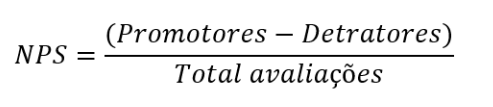

 

Tal abordagem foi utilizada para analisar a diferença dessa métrica entre pedidos entregues dentro e fora do prazo, conforme indicado pelo estudo de Andrade e Lelis (2024), que, atrasos nas entrega é um fator crítico de insatisfação no comércio digital. O resultado dessa comparação é aprensetado no gráfico da Figura 1 a seguir.

  <strong>Figura 1 - Comparação da métrica NPS para pedidos entregues no prazo e fora do prazo.</strong>

  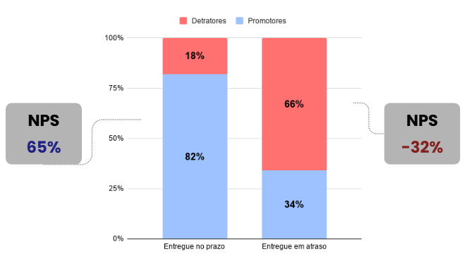

Os gráficos de barras de participação percentual e o indicador NPS indicam que os atrasos nas entregas podem estar influenciando as avaliações dos clientes. O NPS de 65% para os pedidos entregues no prazo sugere que os clientes estão satisfeitos, são fiéis, dão boas recomendações, além de ser um bom indicativo de crescimento e retenção. Enquanto que para os pedidos entregues em atraso, o NPS é de -32%, apontando uma insatisfação dos clientes, churn e má reputação.

Os resultados da análise indicam que a variável de status da entrega é uma forte candidata de influência no comportamento da variável dependente, sendo a escolhida para o modelo logit. Dessa forma, a função logit é determinada pela seguinte equação:

(2)

  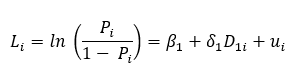

Onde:

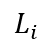 = É o logaritmo da razão de chances (log-odds) do cliente avaliar um pedido como ruim;

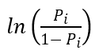 = Representa o logaritmo natural da razão entre a probabilidade da avaliação negativa (Pi) e a probabilidade de avaliação positiva (1-Pi);

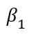 = É o termo constante da regressão, representando o log-odds das avaliações negativas quando todas as variáveis independentes forem iguais a zero;

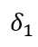 = Parâmetro que indica o efeito da variável qualitativa de entregas atrasadas sobre as avaliações negativas dos clientes;

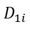 = Variável dummy que assume valor 1 se a entrega foi feita em atraso e 0 para entregas dentro do prazo.

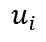 = É o termo de erro, que capta o efeito de variáveis não observadas que também influenciam o resultado.

Os coeficientes estimados pelo modelo representam variações nos log-odds, e não nas probabilidades diretamente. Para que esses coeficientes tenham interpretação prática, é necessário exponencia-los, obtendo então os chamadas odds ratios, para isso, utiliza-se a seguinte fórmula:

(3)

  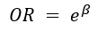

Com isso, obtêm-se as especificações necessárias para a análise da probabilidade de avaliações negativas por parte dos clientes, em conformidade com as recomendações da literatura. O próximo tópico é dedicado exclusivamente à análise dos resultados do modelo logit.

## 4. Resultados
A Figura 2 apresenta os principais resultados do modelo logit estimado, incluindo o pseudo R² como medida de ajuste, os coeficientes estimados, os erros-padrão, os níveis de significância estatística e os respectivos intervalos de confiança.

  <strong>Figura 2 - Resultados do modelo logit estimado.</strong>

  

  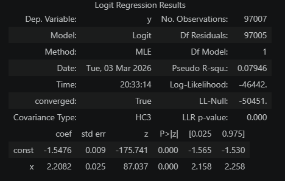

Os resultados do modelo logit indicam uma estimação estatisticamente válida. A significância global (p-valor = 0,000) indica que o modelo é estatisticamente superior ao modelo nulo, e o valor do pseudo R² (0,07946) sugere um ganho de ajuste em relação a este. O coeficiente estimado para a variável dummy de status da entrega é positivo e estatisticamente significativo, indicando que, quando a variável assume valor igual a 1 (pedidos entregues em atraso), há um aumento na probabilidade de o cliente ser classificado como detrator. Além disso, o intervalo de confiança não inclui zero, reforçando a robustez do resultado.

### 4.1. Análise do coeficiente estimado
Aplicando a Equação 3 ao coeficiente estimado da variável dummy, obtém-se o valor de 9,1. Esse resultado indica que pedidos entregues fora do prazo apresentam uma razão de chances 9,1 vezes maior de receber avaliação negativa em comparação aos pedidos entregues dentro do prazo.

Esse achado sugere, do ponto de vista gerencial, que o atraso na entrega é um fator relevante para a insatisfação dos clientes. Assim, a implementação e o monitoramento de ações voltadas ao aumento da eficiência logística tendem a reduzir a incidência de avaliações negativas. Como consequência, espera-se o aumento da proporção de clientes promotores, o fortalecimento da fidelização, a elevação do consumo recorrente e a redução dos custos de aquisição de clientes, como despesas com marketing e prospecção. Além disso, clientes mais fiéis tendem a apresentar menor sensibilidade a variações de preço, reduzindo a elasticidade-preço da demanda.

## 5. Etapas em andamento
As próximas etapas do projeto visam aprofundar a análise dos determinantes das avaliações negativas e seus impactos sobre o desempenho da empresa.

Inicialmente, será aplicada uma transformação no coeficiente estimado do modelo logit, com o objetivo de interpretar os resultados em termos de probabilidade, facilitando a análise e a comunicação dos efeitos das variáveis explicativas sobre a variável dependente.

Na sequência, serão exploradas novas perguntas de negócio que permitam um maior detalhamento das análises. Entre elas, destacam-se: quais setores de produtos apresentam maior incidência de avaliações negativas e quais possuem maior impacto sobre essas avaliações. Essas investigações contribuirão para o direcionamento de ações estratégicas voltadas à melhoria da eficiência logística, especialmente no cumprimento dos prazos de entrega.

Além disso, será analisada a relação entre avaliações negativas e o comportamento de compra dos clientes. Busca-se responder se clientes que realizaram avaliações negativas voltam a comprar, bem como comparar o volume de compras desses clientes em relação aos clientes promotores. Essa análise permitirá mensurar o impacto das avaliações negativas sobre o faturamento, evidenciando como melhorias na experiência do cliente, como entregas dentro do prazo, podem influenciar positivamente a lucratividade da empresa.

Por fim, o projeto avançará para a aplicação de modelos preditivos, com o objetivo de identificar, antecipadamente, situações em que há maior probabilidade de ocorrência de avaliações negativas e estimar seus efeitos sobre o faturamento.

Com os resultados dessas etapas, será possível identificar padrões sazonais em que o faturamento é mais sensível às avaliações negativas. Considerando que determinados produtos apresentam maior demanda em períodos específicos do ano, a identificação daqueles com maior incidência de avaliações negativas permitirá antecipar seus impactos financeiros. Dessa forma, será possível desenvolver ações preventivas para mitigar esses efeitos, contribuindo para uma melhor gestão do fluxo de caixa e para a maximização dos resultados da empresa.

## Referências
ACAYABA, E.; SANTOS, R.; BISPO, T. Predição de Satisfação de Clientes Utilizando Modelos de Machine Learning em Pesquisa Net Promoter Score. Revista de Engenharia e Pesquisa Aplicada, v. 6, n. 5, p. 65-72, 19 nov. 2021.

ANDRADE, Gabriel Paulino Santos de; LELIS, Eliacy Cavalcanti. Qualidade de entrega no comércio eletrônico do Mercado Livre: estudo na logística de entrega de uma empresa do setor de autopeças. Revista FATEC Zona Sul, v. 11, n. 1, 2024. CEETEPS – Unidade de Pós-Graduação, Extensão e Pesquisa.

GUJARATI, Damodar N. Econometria básica. 5. ed. Porto Alegre: AMGH, 2011.

### **(Projeto em andamento)**

### Atalhos para acesso aos arquivos do projeto
[Clique aqui](notebook/modelo.ipynb) para acessar ao notebook do modelo de regressão logística.   
[Clique aqui](querys/analise-1/query_nps.sql) para acessar a query com o cálculo do indicador NPS.     
[Clique aqui](querys/analise-1/query_db_logit.sql) para acessar a query com a estruturação da base de dados elaborada para o modelo logit.