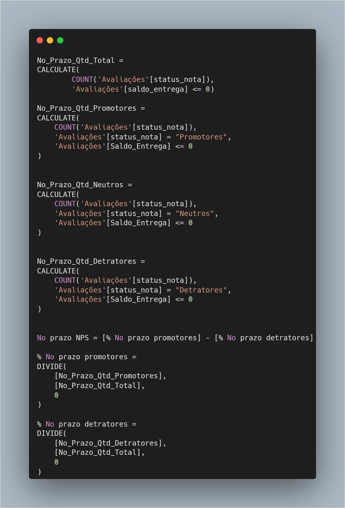

# Análise de negócios: avaliações dos clientes
### Utilizando a base de dados da Olist
Projeto desenvolvido como intuito de portfólio com o objetivo de praticar as seguintes habilidades:

- Resolução de problemas utilizando a técnica de árvore de hipóteses;
- Querys SQL;
- Medidas DAX.

Para acessar ao PDF da análise completa [clique aqui](apresentacao/análise.pdf).  
Para acessar aos indicadores criados no Power BI [clique aqui](https://app.powerbi.com/view?r=eyJrIjoiMDk0ZDA5MTItODYwZi00YjUwLTg4YmEtZDE1NDhjNmM3ODk1IiwidCI6IjMwYjFlNWVhLWUwNWUtNGE3Ny05OWQzLWEzYzYyYzMyODc4NCJ9).    
As querys e medidas DAX elaboradas estão disponíveis neste diretório logo abaixo.

### Querys SQL

- Cálculo para a métrica NPS:  

    

- Extraindo dados para realização da análise no BI  

    

### Medidas DAX

- Cálculos para todas as avaliações (as medidas foram criadas separadas)

    

- Cálculos para as avaliações com pedidos entregues dentro do prazo estimado(as medidas foram criadas separadas)

    

- Cálculos para as avaliações com pedidos entregues atrasados (as medidas foram criadas separadas)

    

